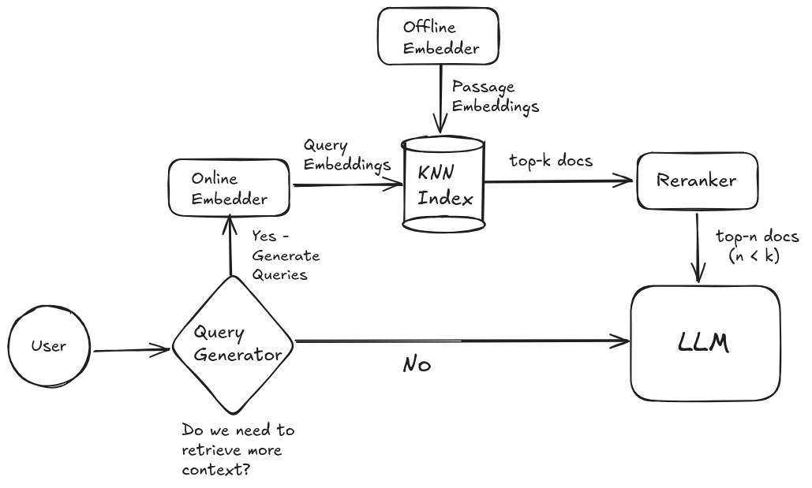

# RAG Demo

This is a demo of a RAG system using the 5 million most popular passages from a 2022 Wikipedia dump. The dataset is available [here](https://huggingface.co/datasets/Cohere/wikipedia-22-12).

## Components

### Query Generator
- Llama 3.1 70B Instruct (8 bit quantization)
- Hosted on Together API

### Embedder
- [BAAI/bge-base-en-v1.5](https://huggingface.co/BAAI/bge-base-en-v1.5)
- Offline Embeddings are computed on 2 RTX 4090's for one hour
- Online Embedder runs on a serverless RTX 4090 pod
- [Infinity server](https://github.com/michaelfeil/infinity) to host the embedding model

### Index
- [Faiss](https://github.com/facebookresearch/faiss)[/AutoFaiss](https://github.com/criteo/autofaiss) with HNSW algorithm
- Runs locally

### Re-ranker
- Salesforce/Llama-Rank-v1 (closed-weights)
- Hosted on Together API

### Response Generation
- Llama 3.1 70B Instruct (8 bit quantization)
- Hosted on Together API

## Instructions to run the demo

1. Encode the dataset and build the index using `embeddings-index.ipynb`. Then copy the texts and the index to your local machine.

   The notebook provides code to do the following:
   - Download the wikipedia dataset and dump the first 5 million rows into a json file
   - Encode the texts in this json file using BAAI/bge-base-en-v1.5 and save the embeddings
   - Build an index using AutoFaiss
   - Search using Faiss

2. Create the relevant API keys and set the environment variables:
   - [Together API](http://api.together.ai/)
   - [OpenAI API](https://platform.openai.com/)
   - [RunPod API](https://www.runpod.io/)

3. Create an endpoint on [RunPod](https://www.runpod.io/) for the `BAAI/bge-base-en-v1.5` embedding model:
   - Go to the [Serverless Console](https://www.runpod.io/console/serverless)
   - Click on "Infinity Vector Embeddings" and select `BAAI/bge-base-en-v1.5`
   - Deploy the endpoint with default settings with the GPU of your choice
   - Set the `Max Workers` to 1 and `Max Duration` to 100 seconds
   - Copy the `API Key` to your environment and `Endpoint URL` to the `chat.py` file

4. Run the chatbot using `chat.py`